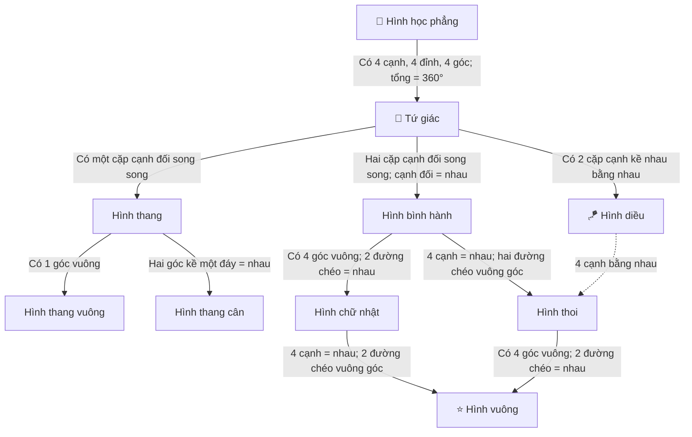

# DỰ ÁN CUỐI CHƯƠNG NEO4J - NHÓM 9
## XÂY DỰNG ỨNG DỤNG HỖ TRỢ HỌC TOÁN HÌNH HỌC PHẲNG (TỨ GIÁC) CHO TRẺ EM

> **Học phần:** Cơ sở dữ liệu NoSQL (Học phần Neo4j Graph Database)  
> **Nhóm thực hiện:** Nhóm 9  
> **Ngôn ngữ & Công nghệ:** PHP 8, Neo4j Graph Database, Cypher, Vis-network, HTML5/CSS3/SVG Edu Kids  

---

## 📋 NỘI DUNG NỘP BÀI (THEO ĐÚNG YÊU CẦU CỦA GIẢNG VIÊN)

Theo đúng yêu cầu đề tài dự án cuối chương, hồ sơ đồ án của Nhóm 9 gồm đầy đủ 4 hạng mục sau:

1. 📄 **Hồ sơ đặc tả yêu cầu (SRS):** [Xem chi tiết tại docs/01_HO_SO_DAC_TA_YEU_CAU.md](docs/01_HO_SO_DAC_TA_YEU_CAU.md)
2. 📊 **Product Backlog (Agile / Scrum):** [Xem chi tiết tại docs/02_PRODUCT_BACKLOG.md](docs/02_PRODUCT_BACKLOG.md)
3. 💻 **Mã nguồn dự án:** Toàn bộ source code PHP + Script Cypher nằm trong repository này.
4. 📖 **Hướng dẫn cài đặt & sử dụng:** [Xem chi tiết tại docs/03_HUONG_DAN_CAI_DAT_VA_SU_DUNG.md](docs/03_HUONG_DAN_CAI_DAT_VA_SU_DUNG.md)

---

## 🕸️ SƠ ĐỒ ĐỒ THỊ NEO4J CÁC HÌNH TỨ GIÁC (GRAPH SCHEMA)

Mô hình đồ thị được xây dựng chính xác và phát triển hoàn thiện dựa trên sơ đồ mẫu của giảng viên:



---

## 🚀 TÍNH NĂNG NỔI BẬT CỦA ỨNG DỤNG WEB

1. **🕸️ Trực quan hóa Sơ đồ Cây Phả Hệ (`index.php`):** Hiển thị đồ thị đa tầng sống động bằng Vis-network; click vào hình bất kỳ sẽ hiển thị định nghĩa, công thức và nút nghe đọc giọng nói (Text-to-Speech).
2. **📚 Danh mục & Chi tiết 9 Hình Tứ giác (`shapes.php`):** Khám phá định nghĩa dí dỏm, ứng dụng trong cuộc sống thực tế và hình minh họa SVG chuẩn xác.
3. **🔮 Cỗ máy biến hình (`transformer.php`):** Sử dụng thuật toán `shortestPath` trong đồ thị Neo4j để chỉ ra con đường biến hình ngắn nhất từ hình này sang hình khác kèm các điều kiện bổ sung.
4. **🧮 Máy tính Chu vi & Diện tích trực quan (`calculator.php`):** Nhập số đo các cạnh hoặc chiều cao, **hình vẽ SVG tự động co giãn kích thước thời gian thực** và hiển thị lời giải từng bước cho học sinh.
5. **⚖️ So sánh 2 hình tứ giác (`compare.php`):** Đặt 2 hình cạnh nhau để thấy rõ điểm giống nhau (quan hệ kế thừa chung) và điểm khác biệt cần lưu ý.
6. **🎮 Đấu trường Đố vui Quiz (`quiz.php`):** Trò chơi đố vui công thức & đoán hình với âm thanh vui nhộn, hiệu ứng pháo hoa chúc mừng và trao tặng danh hiệu Huy hiệu Toán học.
7. **⚡ Trung tâm Quản trị Cypher Console (`neo4j_console.php`):** Kiểm tra kết nối Neo4j, nạp toàn bộ dữ liệu 1-click hoặc thực thi Cypher tùy biến ngay trên web.
8. **🛡️ Cơ chế Fallback thông minh:** Website tự động nhận diện nếu chưa bật Neo4j thì chuyển sang dữ liệu đồ thị cache nội bộ mà không bao giờ bị lỗi màn hình trắng!

---

## ⚡ HƯỚNG DẪN KHỞI CHẠY NHANH TRONG 1 PHÚT

### 1. Khởi chạy Web Server PHP
Mở PowerShell hoặc Command Prompt tại thư mục dự án và chạy lệnh:
```powershell
php -S localhost:8000
```
Truy cập trình duyệt: **`http://localhost:8000`**

### 2. Nạp dữ liệu vào Neo4j
- **Cách 1 (Khuyên dùng):** Truy cập `http://localhost:8000/neo4j_console.php` và bấm nút **"⚡ Nạp Toàn Bộ Dữ Liệu Tứ Giác Vào Neo4j (1-Click Seed)"**.
- **Cách 2:** Mở file [database/setup_quadrilaterals.cypher](database/setup_quadrilaterals.cypher), copy và dán vào [Neo4j Browser](http://localhost:7474) rồi nhấn **Run**.

---

## 📂 CẤU TRÚC THƯ MỤC DỰ ÁN

```
Nhom9_Neo4j_TuGiac/
├── database/
│   ├── setup_quadrilaterals.cypher     # Kịch bản Cypher toàn diện khởi tạo CSDL Neo4j
│   └── queries_sample.cypher           # Tổng hợp các câu truy vấn Cypher mẫu nâng cao
├── docs/
│   ├── 01_HO_SO_DAC_TA_YEU_CAU.md      # Hồ sơ đặc tả yêu cầu phần mềm (SRS)
│   ├── 02_PRODUCT_BACKLOG.md           # Product backlog theo chuẩn Agile/Scrum
│   └── 03_HUONG_DAN_CAI_DAT_VA_SU_DUNG.md # Hướng dẫn cài đặt và sử dụng chi tiết
├── classes/
│   ├── Neo4jService.php                # Lớp kết nối HTTP REST API & Transaction Cypher
│   └── GeometryModel.php               # Lớp xử lý nghiệp vụ, so sánh, biến hình, tính toán
├── config/
│   └── config.php                      # Cấu hình môi trường và tài khoản Neo4j
├── assets/
│   ├── css/style.css                   # Giao diện tươi sáng, hiện đại (Edu Kids UI)
│   └── js/
│       ├── app.js                      # Âm thanh Web Audio, Text-to-Speech & Confetti
│       ├── graph-view.js               # Render đồ thị tương tác Vis-network
│       ├── calculator.js               # Máy tính hình học & SVG động thời gian thực
│       ├── transformer.js              # Cỗ máy biến hình shortestPath
│       └── quiz.js                     # Trò chơi đố vui toán học thiếu nhi
├── includes/
│   ├── header.php                      # Thanh điều hướng và chỉ báo kết nối Neo4j
│   ├── footer.php                      # Footer thông tin nhóm 9
│   └── svg_shapes.php                  # Bộ sinh hình vẽ SVG minh họa sắc nét
├── index.php                           # Trang chủ: Sơ đồ đồ thị cây phả hệ Neo4j
├── shapes.php                          # Danh mục & Chi tiết các hình tứ giác
├── calculator.php                      # Máy tính chu vi & diện tích trực quan
├── transformer.php                     # Cỗ máy biến hình (Shape Transformer)
├── compare.php                         # So sánh 2 hình tứ giác
├── quiz.php                            # Đấu trường đố vui toán học
├── neo4j_console.php                   # Quản trị & Thực thi Cypher console trực tiếp
├── api.php                             # REST API xử lý AJAX
├── composer.json                       # Cấu hình dự án PHP
└── README.md                           # Báo cáo tổng quan dự án
```
